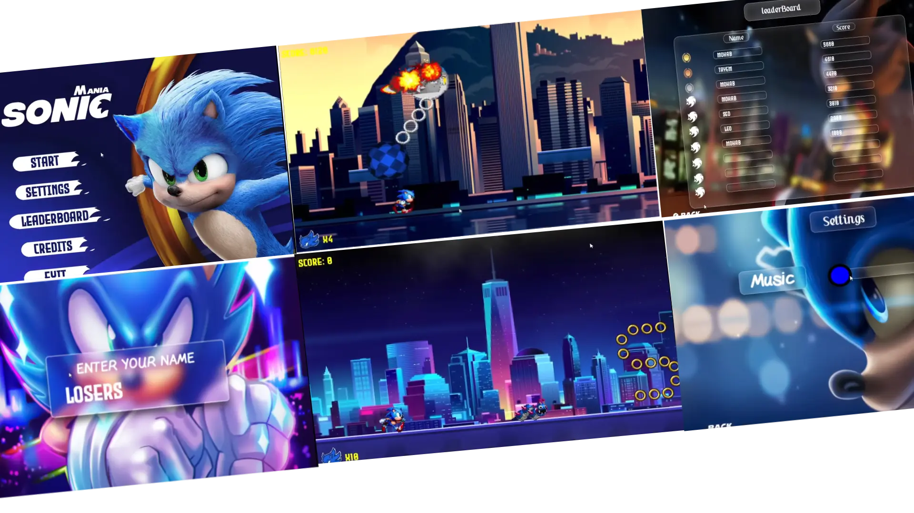

https://github.com/MarkoSami

<h1 align="center">Projects</h1>

<h2 align="center">Biggest Projects First</h2>

<table>
  <tr>
    <td width='50%' colspan=2>
      <h2 align='center'>ScreenMates</h2>
      
  
        
         
         
        

          
          
          
        

        
<strong>React, Socket IO, NodeJS, Express, MongoDB, Cloudinary, </strong>

      

    </td>
  </tr>
  <tr>
    <td width='50%'>
      <h2 align='center'>Decorate my tree</h2>
      
  
        
         
         
        

          
        

        
<strong>React, FramerMotion, NodeJs, Express, MongoDB</strong>

      

    </td>
  </tr>
  <tr>
    <td width='50%'>
      <h2 align='center'>Sonic Mania</h2>
      
  
        
         
         
        

          
        

        
<strong>C++, SFML, Problem Solving, Figma</strong>

      

    </td>
  </tr>
  <tr>
    <td width='50%'>
      <h2 align='center'>ChatVibes</h2>
       
  
        
         
        

         
        

        
<strong>Data Structure, OOP, C++, QT</strong>

      

    </td>
  </tr>
</table>

